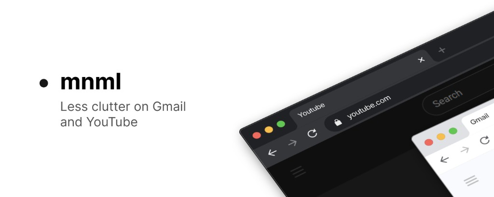

# mnml

[](https://chromewebstore.google.com/detail/mnml/jkbikdenghbgmceehglljbbnhfalkcpg)

**[Add to Chrome](https://chromewebstore.google.com/detail/mnml/jkbikdenghbgmceehglljbbnhfalkcpg)** · [Website](https://mnml.teerakit.com/) · [Privacy policy](https://mnml.teerakit.com/privacy/)

Monorepo for **mnml** — a Chrome extension that hides distracting UI on Gmail, YouTube, and more — plus its marketing site and privacy policy.

| Package | Path | Description |
|---------|------|-------------|
| Extension | [`apps/extension`](apps/extension) | WXT + React Chrome extension |
| Web | [`docs`](docs) | Static HTML/CSS marketing site (GitHub Pages) |

## Setup

From the repo root:

```bash
pnpm install
```

## Development

**Extension** (loads from `apps/extension/.output/chrome-mv3`):

```bash
pnpm dev
```

**Marketing site** ([http://localhost:4321/](http://localhost:4321/)):

```bash
pnpm dev:web
```

## Build

```bash
pnpm build          # extension
pnpm zip              # extension zip for store upload
pnpm compile          # extension TypeScript check
```

The website has no build step — edit HTML/CSS in `docs/` directly.

## Privacy policy

The public privacy policy lives at [https://mnml.teerakit.com/privacy/](https://mnml.teerakit.com/privacy/). Source: [`docs/privacy/index.html`](docs/privacy/index.html) (sync with [`apps/extension/PRIVACY.md`](apps/extension/PRIVACY.md)).

## Deploy (GitHub Pages)

In the repo: **Settings → Pages → Source: Deploy from a branch**

- **Branch:** `main`
- **Folder:** `/docs`

Push changes under `docs/` to publish. Live site: [https://mnml.teerakit.com/](https://mnml.teerakit.com/)

See [`docs/README.md`](docs/README.md) for content maintenance.
